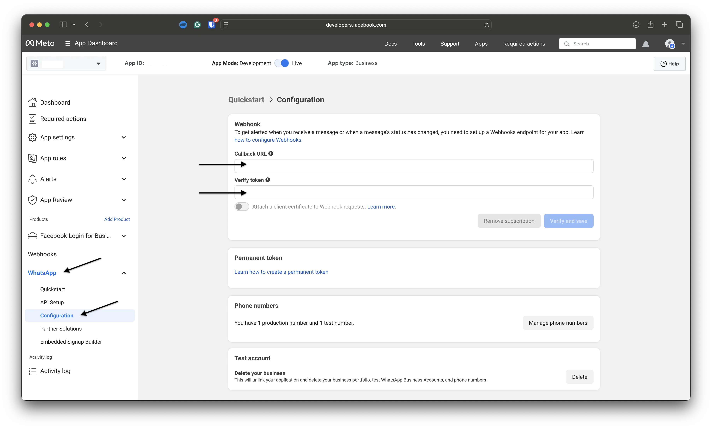
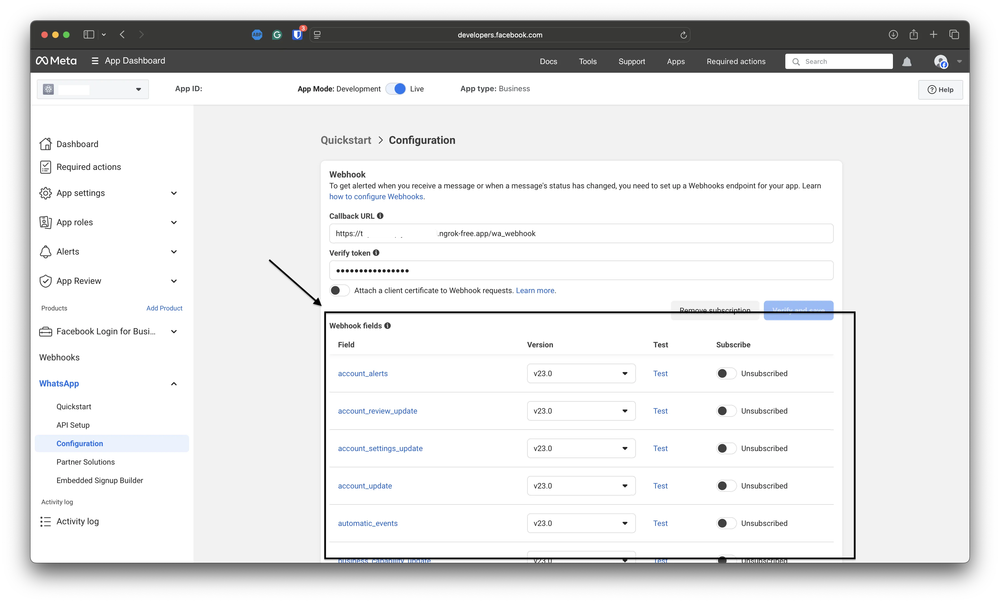

🎛️ Handlers
==================

.. currentmodule:: pywa.handlers

Handlers are where your bot reacts to incoming WhatsApp updates.

In pywa, every incoming webhook update is converted into a typed update object, such as
:class:`~pywa.types.message.Message`, :class:`~pywa.types.callback.CallbackButton`, or
:class:`~pywa.types.message_status.MessageStatus`. You register callback functions for the update types you
care about, and pywa calls the right function when WhatsApp sends an update.

The usual workflow is:

1. Create a :class:`~pywa.client.WhatsApp` client.
2. Register handlers with decorators or ``Handler`` objects.
3. Give WhatsApp a public callback URL.
4. Run the app with ``pywa dev`` while developing, or ``pywa run`` for production.

This guide starts with the day-to-day part: writing handlers.

Your First Handler
------------------

A handler callback receives the WhatsApp client and the update object.

.. code-block:: python
    :caption: main.py
    :linenos:
    :emphasize-lines: 9-11

    from pywa import WhatsApp, filters, types

    wa = WhatsApp(
        phone_id="1234567890",
        token="EAA...",
        verify_token="my-verify-token",
    )

    @wa.on_message(filters.text)
    def echo(client: WhatsApp, msg: types.Message):
        msg.reply(f"You said: {msg.text}")

Then run the file with the pywa CLI:

.. code-block:: bash
    :caption: Terminal

    pywa dev

``pywa dev`` starts the webhook server and reloads it when your code changes.

Registering Handlers
--------------------

You can register handlers in two main ways:

- Decorators, which are the simplest option for most projects.
- ``*Handler`` objects, which are useful when handlers are assembled dynamically.

Using decorators
^^^^^^^^^^^^^^^^

Use the ``on_...`` decorators on your :class:`~pywa.client.WhatsApp` client.

.. code-block:: python
    :caption: main.py
    :linenos:
    :emphasize-lines: 5, 9

    from pywa import WhatsApp, types

    wa = WhatsApp(...)

    @wa.on_message
    def handle_message(client: WhatsApp, msg: types.Message):
        print(msg)

    @wa.on_callback_button
    def handle_callback_button(client: WhatsApp, clb: types.CallbackButton):
        clb.react("❤️")

You can pass filters to the handlers:

.. code-block:: python
    :caption: main.py
    :linenos:
    :emphasize-lines: 5, 9

    from pywa import WhatsApp, filters, types

    wa = WhatsApp(...)

    @wa.on_message(filters.text)
    def handle_text_message(client: WhatsApp, msg: types.Message):
        msg.reply(f"You said: {msg.text}")

    @wa.on_message(filters.image | filters.video)
    def handle_media_message(client: WhatsApp, msg: types.Message):
        msg.reply(f"Thanks for sending a media message.")

See the `filters guide <../filters/overview.html>`_ for built-in filters and custom filters.

Loading handlers from modules
^^^^^^^^^^^^^^^^^^^^^^^^^^^^^

If your handlers live in another module and do not have direct access to the client instance,
register them on the :class:`~pywa.client.WhatsApp` **class**:

.. code-block:: python
    :caption: my_handlers.py
    :linenos:
    :emphasize-lines: 3

    from pywa import WhatsApp, filters, types

    @WhatsApp.on_message(filters.text) # Register on the class, not an instance
    def handle_text(client: WhatsApp, msg: types.Message):
        msg.reply(msg.text)

Then load that module when creating the client:

.. code-block:: python
    :caption: main.py
    :linenos:
    :emphasize-lines: 2, 6

    from pywa import WhatsApp
    from . import my_handlers # Import the module that holds the handlers

    wa = WhatsApp(
        ...,
        handlers_modules=[my_handlers,], # Pass the module to load handlers from it
    )

You can also load modules later:

.. code-block:: python

    wa.load_handlers_modules(my_handlers)

Dynamic Handler Registration
^^^^^^^^^^^^^^^^^^^^^^^^^^^^

You can register and remove handlers dynamically at runtime instead of declaring them all at startup. This is useful for state-dependent workflows (e.g., toggling a temporary maintenance mode) where handlers are added or removed on the fly.

To register a handler dynamically, instantiate one of the `Available Handlers` and pass it to :meth:`~pywa.client.WhatsApp.add_handlers`. To stop listening, pass the same handler instance to :meth:`~pywa.client.WhatsApp.remove_handlers`.

Here is an example demonstrating how to register a high-priority maintenance handler and dynamically remove it:

.. code-block:: python
    :caption: main.py
    :linenos:
    :emphasize-lines: 13-16, 23, 26

    from pywa import WhatsApp, filters, handlers, types

    wa = WhatsApp(...)

    admin_filter = filters.from_users("1234567890", "9876543210")

    # Define a high-priority handler callback that intercepts messages during maintenance
    def maintenance_callback(client: WhatsApp, msg: types.Message):
        msg.reply("🛠️ The bot is currently undergoing maintenance. Please try again later.")
        msg.stop_handling()  # Prevent other, lower-priority handlers from running

    # Create the handler instance with high priority
    maintenance_handler = handlers.MessageHandler(
        callback=maintenance_callback,
        filters=~admin_filter, # Only non-admins
        priority=100,
    )

    # Handler to turn maintenance mode ON or OFF
    @wa.on_message(filters.command("maintenance") & admin_filter)
    def enable_maintenance(client: WhatsApp, msg: types.Message):
        if msg.text.split("maintenance")[1].strip() == "on":
            client.add_handlers(maintenance_handler)
            msg.reply("Maintenance mode has been activated.")
        else:
            client.remove_handlers(maintenance_handler, silent=True)
            msg.reply("Maintenance mode has been deactivated.")

Available Handlers
------------------

.. list-table::
   :widths: 20 20 60
   :header-rows: 1

   * - Decorator
     - Handler
     - Update type
   * - :meth:`~pywa.client.WhatsApp.on_message`
     - :class:`MessageHandler`
     - :class:`~pywa.types.message.Message`
   * - :meth:`~pywa.client.WhatsApp.on_callback_button`
     - :class:`CallbackButtonHandler`
     - :class:`~pywa.types.callback.CallbackButton`
   * - :meth:`~pywa.client.WhatsApp.on_callback_selection`
     - :class:`CallbackSelectionHandler`
     - :class:`~pywa.types.callback.CallbackSelection`
   * - :meth:`~pywa.client.WhatsApp.on_flow_completion`
     - :class:`FlowCompletionHandler`
     - :class:`~pywa.types.flows.FlowCompletion`
   * - :meth:`~pywa.client.WhatsApp.on_flow_request`
     - :class:`FlowRequestHandler`
     - :class:`~pywa.types.flows.FlowRequest`
   * - :meth:`~pywa.client.WhatsApp.on_message_status`
     - :class:`MessageStatusHandler`
     - :class:`~pywa.types.message_status.MessageStatus`
   * - :meth:`~pywa.client.WhatsApp.on_template_status_update`
     - :class:`TemplateStatusUpdateHandler`
     - :class:`~pywa.types.templates.TemplateStatusUpdate`
   * - :meth:`~pywa.client.WhatsApp.on_template_category_update`
     - :class:`TemplateCategoryUpdateHandler`
     - :class:`~pywa.types.templates.TemplateCategoryUpdate`
   * - :meth:`~pywa.client.WhatsApp.on_template_quality_update`
     - :class:`TemplateQualityUpdateHandler`
     - :class:`~pywa.types.templates.TemplateQualityUpdate`
   * - :meth:`~pywa.client.WhatsApp.on_template_components_update`
     - :class:`TemplateComponentsUpdateHandler`
     - :class:`~pywa.types.templates.TemplateComponentsUpdate`
   * - :meth:`~pywa.client.WhatsApp.on_phone_number_change`
     - :class:`PhoneNumberChangeHandler`
     - :class:`~pywa.types.system.PhoneNumberChange`
   * - :meth:`~pywa.client.WhatsApp.on_identity_change`
     - :class:`IdentityChangeHandler`
     - :class:`~pywa.types.system.IdentityChange`
   * - :meth:`~pywa.client.WhatsApp.on_call_connect`
     - :class:`CallConnectHandler`
     - :class:`~pywa.types.calls.CallConnect`
   * - :meth:`~pywa.client.WhatsApp.on_call_terminate`
     - :class:`CallTerminateHandler`
     - :class:`~pywa.types.calls.CallTerminate`
   * - :meth:`~pywa.client.WhatsApp.on_call_status`
     - :class:`CallStatusHandler`
     - :class:`~pywa.types.calls.CallStatus`
   * - :meth:`~pywa.client.WhatsApp.on_call_permission_update`
     - :class:`CallPermissionUpdateHandler`
     - :class:`~pywa.types.calls.CallPermissionUpdate`
   * - :meth:`~pywa.client.WhatsApp.on_user_marketing_preferences`
     - :class:`UserMarketingPreferencesHandler`
     - :class:`~pywa.types.user_preferences.UserMarketingPreferences`
   * - :meth:`~pywa.client.WhatsApp.on_edited_message`
     - :class:`EditedMessageHandler`
     - :class:`~pywa.types.message.EditedMessage`
   * - :meth:`~pywa.client.WhatsApp.on_deleted_message`
     - :class:`DeletedMessageHandler`
     - :class:`~pywa.types.message.DeletedMessage`
   * - :meth:`~pywa.client.WhatsApp.on_outgoing_message`
     - :class:`OutgoingMessageHandler`
     - :class:`~pywa.types.message.OutgoingMessage`
   * - :meth:`~pywa.client.WhatsApp.on_outgoing_edited_message`
     - :class:`OutgoingEditedMessageHandler`
     - :class:`~pywa.types.OutgoingEditedMessage`
   * - :meth:`~pywa.client.WhatsApp.on_outgoing_deleted_message`
     - :class:`OutgoingDeletedMessageHandler`
     - :class:`~pywa.types.message.OutgoingDeletedMessage`
   * - :meth:`~pywa.client.WhatsApp.on_account_update`
     - :class:`AccountUpdateHandler`
     - :class:`~pywa.types.account_update.AccountUpdate`
   * - :meth:`~pywa.client.WhatsApp.on_raw_update`
     - :class:`RawUpdateHandler`
     - :class:`~pywa.types.base_update.RawUpdate`

Handlers or Listeners?
----------------------

Handlers are best for app entry points: commands, buttons, statuses, template events, and
other updates that start a unit of work.

When you need to continue a conversation and wait for the user's next message, use a listener.

.. code-block:: python
    :caption: main.py
    :linenos:
    :emphasize-lines: 7

    from pywa import WhatsApp, filters, types

    wa = WhatsApp(...)

    @wa.on_message(filters.command("start"))
    def start(client: WhatsApp, msg: types.Message):
        age = msg.reply("Hello! What's your age?").wait_for_reply(filters.text).text
        msg.reply(f"Nice, you are {age}.")

Read more in the `listeners guide <../listeners/overview.html>`_.

Making WhatsApp Reach Your App
------------------------------

WhatsApp sends updates to a public HTTPS callback URL. During local development, that usually
means opening a tunnel from the internet to your local server.

Pywa provides :func:`~pywa.utils.start_ngrok_tunnel` for this:

.. code-block:: python
    :caption: main.py
    :linenos:
    :emphasize-lines: 1, 3-7, 14

    from pywa import WhatsApp, filters, types, utils

    callback_url = utils.start_ngrok_tunnel(
        port=8000,
        auth_token="your-ngrok-auth-token",
        domain="subdomain.ngrok-free.app",
    )

    wa = WhatsApp(
        phone_id="1234567890",
        token="EAA...",
        app_id="1234567890",
        app_secret="xxxx",
        callback_url=callback_url,
        verify_token="my-verify-token",
    )

    @wa.on_message(filters.text)
    def echo(client: WhatsApp, msg: types.Message):
        msg.reply(msg.text)

Run the app:

.. code-block:: bash
    :caption: Terminal

    pywa dev

Install the ``ngrok`` package before using the helper:

.. code-block:: bash
    :caption: Terminal

    pip install ngrok

.. tip::

    Use a static ngrok domain while developing. It keeps the callback URL stable across
    restarts. After the first successful registration, you can usually comment out
    ``callback_url`` to avoid registering the same webhook every time you restart the app.

You can also use any other HTTPS tunnel or deployed URL, such as:

- `Cloudflare Tunnel <https://developers.cloudflare.com/cloudflare-one/connections/connect-networks/>`_
- `localtunnel <https://localtunnel.github.io/www/>`_
- Your production server URL

Registering the Callback URL
----------------------------

WhatsApp must know where to send webhook requests. You can register the callback URL
automatically with pywa or manually in the Meta app dashboard.

Automatic registration
^^^^^^^^^^^^^^^^^^^^^^

Automatic registration is the easiest option for development and for most apps.

Pass ``callback_url`` and ``verify_token`` to :class:`~pywa.client.WhatsApp`. For the default
app-level registration, also pass ``app_id`` and ``app_secret``.

.. code-block:: python
    :caption: main.py
    :linenos:
    :emphasize-lines: 7-9

    from pywa import WhatsApp, utils

    wa = WhatsApp(
        phone_id="1234567890",
        token="EAA...",
        app_id="1234567890",
        app_secret="xxxx",
        callback_url=utils.start_ngrok_tunnel(domain="subdomain.ngrok-free.app"),
        verify_token="my-verify-token",
    )

When the server starts, pywa registers the URL and handles WhatsApp's verification challenge
for you.

By default, pywa registers the URL in the app scope. You can use another scope with
``callback_url_scope``:

.. code-block:: python
    :caption: main.py
    :linenos:
    :emphasize-lines: 7-8

    from pywa import WhatsApp, utils

    wa = WhatsApp(
        phone_id="1234567890",
        token="EAA...",
        verify_token="my-verify-token",
        callback_url="https://example.com",
        callback_url_scope=utils.CallbackURLScope.PHONE,
    )

The required IDs depend on the scope:

.. list-table::
   :widths: 25 40 35
   :header-rows: 1

   * - Scope
     - Registers
     - Required values
   * - ``CallbackURLScope.APP``
     - The app webhook subscription
     - ``app_id`` and ``app_secret``
   * - ``CallbackURLScope.WABA``
     - A WABA alternate callback URL
     - ``waba_id``
   * - ``CallbackURLScope.PHONE``
     - A phone-number alternate callback URL
     - ``phone_id``

Manual registration
^^^^^^^^^^^^^^^^^^^

If you prefer to register the URL yourself:

1. Create the client with the same ``verify_token`` you will enter in Meta.
2. Start the app so pywa can answer the verification challenge.
3. Open **App Dashboard > WhatsApp > Configuration**.
4. Enter your public callback URL and verify token.

.. code-block:: python
    :caption: main.py
    :linenos:
    :emphasize-lines: 5

    from pywa import WhatsApp

    wa = WhatsApp(
        token="EAA...",
        verify_token="my-verify-token",
    )

Subscribing to Webhook Fields
-----------------------------

When registering manually, make sure your app is subscribed to the webhook fields you need.

Go to **App Dashboard > WhatsApp > Configuration** and scroll to **Webhook Fields**.

Pywa can process these fields:

- ``messages`` - user messages, callbacks, and message statuses
- ``calls`` - call connect, terminate, and status updates
- ``message_template_status_update`` - template approval or rejection updates
- ``message_template_quality_update`` - template quality score updates
- ``message_template_components_update`` - template component updates
- ``template_category_update`` - template category changes
- ``user_preferences`` - user marketing preferences
- ``account_update`` - account update events

If you register the callback URL automatically, pywa subscribes to the webhook fields it
supports. You can customize the fields with ``webhook_fields``.

Use :meth:`~pywa.client.WhatsApp.on_raw_update` if you want to receive unsupported webhook
events yourself.

Running pywa
------------

After handlers and callback settings are in place, run the server.

Using the CLI (recommended)
^^^^^^^^^^^^^^^^^^^^^^^^^^^

Install the server extras:

.. code-block:: bash
    :caption: Terminal

    pip install "pywa[server]"

Use ``pywa dev`` while developing:

.. code-block:: bash
    :caption: Terminal

    pywa dev

Use ``pywa run`` when you want to run without auto-reload:

.. code-block:: bash
    :caption: Terminal

    pywa run main.py

Both commands run pywa's built-in Starlette application with Uvicorn and register the webhook
endpoint automatically.

You can also point the CLI to a specific client object:

.. code-block:: bash
    :caption: Terminal

    pywa dev main:wa2
    pywa run --app wa2

Common options include:

.. code-block:: bash
    :caption: Terminal

    pywa dev --reload-dir src
    pywa run --workers 4

Using ``WhatsApp.run()``
^^^^^^^^^^^^^^^^^^^^^^^^

For quick scripts and prototypes, you can start the built-in server directly from Python:

.. code-block:: python
    :caption: main.py
    :linenos:
    :emphasize-lines: 7

    from pywa import WhatsApp

    wa = WhatsApp(...)

    # Register handlers here

    wa.run()

This uses the same Starlette-based webhook app, but it is blocking and does not include the
development features of ``pywa dev``. Prefer ``pywa dev`` and ``pywa run`` for normal use.

Using FastAPI or Flask
^^^^^^^^^^^^^^^^^^^^^^

If your project already has a FastAPI or Flask app, pass it to ``server``.
Pywa registers the webhook routes on that app, and you run the app yourself.

FastAPI:

.. code-block:: python
    :caption: main.py
    :linenos:
    :emphasize-lines: 4, 8-9, 18-21

    from fastapi import FastAPI
    from pywa import WhatsApp, filters, types

    app = FastAPI()

    wa = WhatsApp(
        ...,
        server=app,  # Pass your FastAPI or Flask app here
        webhook_endpoint="/whatsapp",  # Use different endpoint from "/" to avoid conflicts with your own routes
    )

    @wa.on_message(filters.text)
    def echo(client: WhatsApp, msg: types.Message):
        msg.reply(msg.text)

    # Serve your own routes alongside pywa's webhook
    @app.get("/")
    def read_root():
        return {"Hello": "World"}

Run FastAPI normally:

.. code-block:: bash
    :caption: Terminal

    fastapi dev main.py

Flask works the same way:

.. code-block:: python
    :caption: app.py
    :linenos:
    :emphasize-lines: 4, 8-9, 17

    from flask import Flask
    from pywa import WhatsApp, filters, types

    app = Flask(__name__)

    wa = WhatsApp(
        ...,
        server=app,
        webhook_endpoint="/whatsapp",
    )

    @wa.on_message(filters.text)
    def echo(client: WhatsApp, msg: types.Message):
        msg.reply(msg.text)

    if __name__ == "__main__":
        app.run(port=8000)

If you pass a custom FastAPI or Flask server, pywa does not run it for you.

Handler Order and Flow
----------------------

By default, pywa stops after the first handler whose **filter** matches an update.

.. code-block:: python
    :caption: main.py
    :linenos:

    from pywa import WhatsApp, types

    wa = WhatsApp(...)

    @wa.on_message
    def first(client: WhatsApp, msg: types.Message):
        print("first")  # <-- runs, then stops. second() is never called.

    @wa.on_message
    def second(client: WhatsApp, msg: types.Message):
        print("second")  # <-- never reached, because first() matched first.

Handlers run in registration order unless you set ``priority``.
**Higher priority number runs first** — a handler with ``priority=2`` runs before one with ``priority=1``.

.. code-block:: python
    :caption: main.py
    :linenos:
    :emphasize-lines: 5, 9

    from pywa import WhatsApp, types

    wa = WhatsApp(...)

    @wa.on_message(priority=1)
    def first(client: WhatsApp, msg: types.Message):
        print("First:", msg)

    @wa.on_message(priority=2)
    def second(client: WhatsApp, msg: types.Message):
        print("Second:", msg)

To keep checking later handlers by default, enable ``continue_handling``:

.. code-block:: python
    :caption: main.py
    :linenos:

    wa = WhatsApp(..., continue_handling=True)

You can also control the flow from inside a handler with
:meth:`~pywa.types.base_update.BaseUpdate.stop_handling` and
:meth:`~pywa.types.base_update.BaseUpdate.continue_handling`.

.. code-block:: python
    :caption: main.py
    :linenos:
    :emphasize-lines: 8, 10

    from pywa import WhatsApp, filters, types

    wa = WhatsApp(...)

    @wa.on_message(filters.text)
    def handle_message(client: WhatsApp, msg: types.Message):
        if msg.text == "stop":
            msg.stop_handling()
        else:
            msg.continue_handling()

Validating Updates
------------------

WhatsApp `recommends <https://developers.facebook.com/docs/graph-api/webhooks/getting-started#event-notifications>`_
validating incoming webhook requests with the ``X-Hub-Signature-256`` header.

Pywa validates updates by default when ``app_secret`` is provided:

.. code-block:: python
    :caption: main.py
    :linenos:
    :emphasize-lines: 4, 5

    from pywa import WhatsApp

    wa = WhatsApp(
        app_secret="xxxx",
        validate_updates=True,
        ...
    )

If no ``app_secret`` is provided, pywa disables validation and emits a warning. If validation is
enabled and the signature is missing or invalid, pywa rejects the request before calling your
handlers. You can disable validation explicitly with ``validate_updates=False``.

Using Other Web Frameworks
--------------------------

FastAPI and Flask are registered automatically. For any other web framework, create the HTTP
routes yourself and call pywa's webhook helper methods.

Your framework needs two routes on the same endpoint:

- ``GET`` for the verification challenge.
- ``POST`` for incoming webhook updates.

Verification route:

.. code-block:: python
    :caption: main.py
    :linenos:

    challenge, status = wa.webhook_challenge_handler(
        vt=request.GET[utils.HUB_VT],
        ch=request.GET[utils.HUB_CH],
    )

    return challenge, status

Update route:

.. code-block:: python
    :caption: main.py
    :linenos:

    body = request.body

    validation_error = wa.webhook_update_validator(
        update=body,
        hmac_header=request.headers.get(utils.HUB_SIG),
    )

    if validation_error:
        return validation_error

    response, status = wa.webhook_update_handler(update=body)
    return response, status

With manual framework integration, you are responsible for returning the right response format
for your framework and for running the server.

.. note::

    Regardless of how you run pywa (``pywa dev``, ``pywa run``, or :meth:`~pywa.client.WhatsApp.run`),
    it creates a small Starlette app backed by Uvicorn and registers two routes on ``webhook_endpoint``:

    - ``GET`` — answers WhatsApp's verification challenge.
    - ``POST`` — receives and dispatches incoming webhook updates.

    When you pass a FastAPI or Flask ``server``, pywa registers the same routes on that app instead.
    For any other framework, use the :ref:`manual helper methods <Using Other Web Frameworks>` above.

.. tip::

    **Common best practices:**

    - Always add a filter (e.g., ``filters.text``) to message handlers that read ``msg.text``
      so the handler is never called with ``None``.
    - Avoid long blocking operations inside synchronous handlers — they block the entire event loop.
      Use threads or switch to ``pywa_async`` for async handlers.
    - Use ``priority`` sparingly. Explicit filters are usually cleaner than execution ordering.
    - Use ``shared_data`` on the update object to pass context between chained handlers
      instead of global state.

.. toctree::
    handler_decorators
    handler_objects
